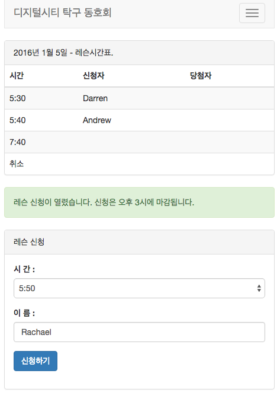

# time vote web application  using google app engine
my toy project using gogle app engine to remove repetitive work. each person can vote one time slot. data reset everyday. GAE is cool. it takes just 3 day to make this after the work.

# running the app locally
`mvn appengine:devserver`
see localhost:8080/lesson.html

# deploying the app
`mvn appengine:deploy`

# spec
## rest apis
* /tt_vote?name=xxx&lessonTime=xxx : vote a person to specfici time
* /tt_trigger?cmd=enable|disable : enable/disable vote
* /tt_table  : return current vote status

# screen shot

